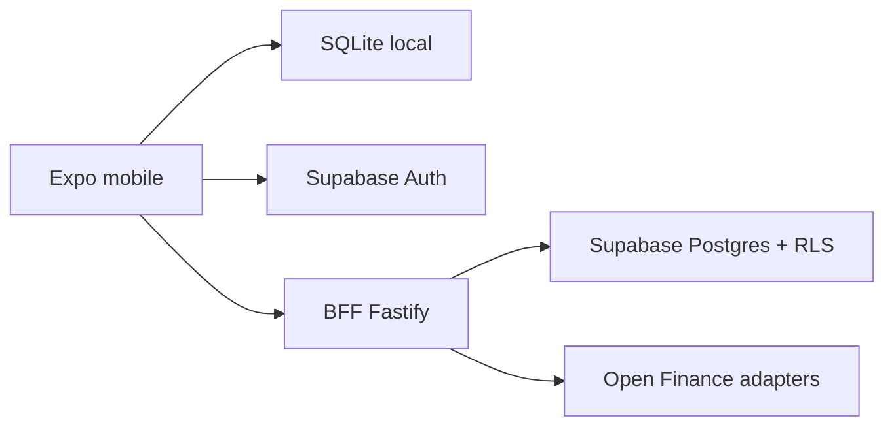

# GoFinances

GoFinances e um app mobile de financas pessoais com foco em uso Brasil-first, experiencia offline-first e sincronizacao cloud via BFF. O app permite registrar transacoes, acompanhar resumo mensal, organizar contas/cartoes, orcamentos, metas, calendario financeiro, importacao/exportacao CSV, compartilhamento e bases para Open Finance.

## Arquitetura

A arquitetura atual segue o modelo 2 definido no roadmap:

- `Expo + React Native`: app mobile Android/iOS.
- `SQLite local`: fonte principal de leitura no dispositivo e suporte offline.
- `Outbox de sync`: mutacoes locais entram na fila `sync_queue` e sao enviadas ao BFF.
- `BFF Node/Fastify`: API em `apps/api`, responsavel por sync, sharing, Open Finance e validacao de token Supabase.
- `Supabase Auth`: autenticacao Google/Apple no app; o mobile usa Supabase direto apenas para Auth.
- `Supabase Postgres`: persistencia remota com RLS, migrations versionadas e indices de producao.
- `Render`: deploy previsto para a API.
- `EAS`: builds, updates e submits do app mobile.

Fluxo simplificado:



## Funcionalidades

- Login com Google/Apple via Supabase Auth.
- Dashboard mensal de receitas, despesas e saldo.
- Cadastro, edicao e exclusao de transacoes.
- Parcelamento, recorrencia e transferencias planejadas.
- Contas, cartoes e faturas.
- Orcamentos mensais por categoria.
- Calendario financeiro e lembretes.
- Importacao e exportacao CSV.
- Sync cloud incremental via BFF.
- Compartilhamento por convite e permissao.
- Metas, insights e fluxo de caixa.
- Base para Open Finance via adapter no BFF.

Documentos por feature ficam em `docs/features/`.

## Estrutura

```text
apps/api/              BFF Fastify com servicos Supabase
src/features/          Codigo mobile organizado por feature
src/shared/            Infra, dominio compartilhado e componentes comuns
supabase/migrations/   Schema remoto, RLS, indices e policies
docs/                  Documentacao tecnica e operacional
e2e/                   Testes Detox
```

## Comandos principais

```bash
npm ci --legacy-peer-deps
npm run api:dev
npm run start
npm run lint
npm run typecheck
npm test -- --runInBand --ci --no-coverage
npm run test:coverage:ci -- --runInBand
```

## Configuracao, testes e deploy

O passo a passo completo esta em [docs/setup-deploy.md](docs/setup-deploy.md).

Resumo:

1. Criar projeto Supabase e aplicar migrations em `supabase/migrations`.
2. Configurar Supabase Auth com Google/Apple.
3. Criar `.env` a partir de `.env.example`.
4. Rodar a API local com `npm run api:dev`.
5. Rodar o app com `npm run start`, `npm run android` ou `npm run ios`.
6. Validar `lint`, `typecheck`, testes, cobertura e, quando houver emulador, Detox.
7. Subir API no Render usando `render.yaml`.
8. Criar builds mobile com EAS.

## Qualidade

O projeto segue TDD para novas funcionalidades e usa gates de qualidade:

- `lint`
- `tsc --noEmit`
- unit tests
- integration tests
- API tests
- coverage global minimo de 85%
- dominio e sync com cobertura reforcada
- Detox smoke Android no PR e regressao completa nightly

## Observacoes de producao

- O app e offline-first: SQLite local continua sendo a fonte de leitura do mobile.
- O BFF valida o Bearer token Supabase e usa client Supabase autenticado pelo usuario para preservar RLS.
- `SUPABASE_SERVICE_ROLE_KEY` deve ficar apenas no servidor, nunca no app mobile.
- Variaveis `EXPO_PUBLIC_*` entram no bundle mobile e devem ser tratadas como publicas.
- Para Android emulator, a API local normalmente deve ser acessada por `http://10.0.2.2:3333`; em aparelho fisico, use o IP da maquina na rede local.

